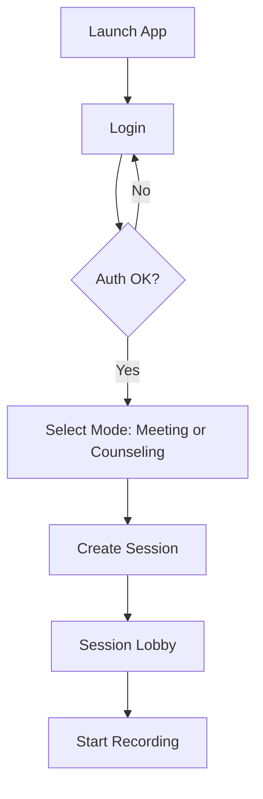
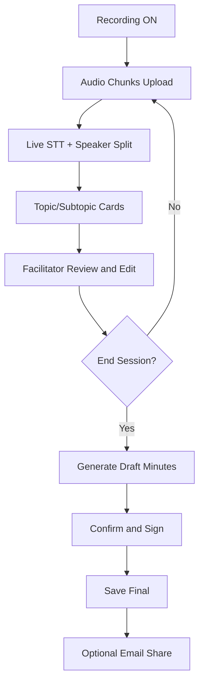
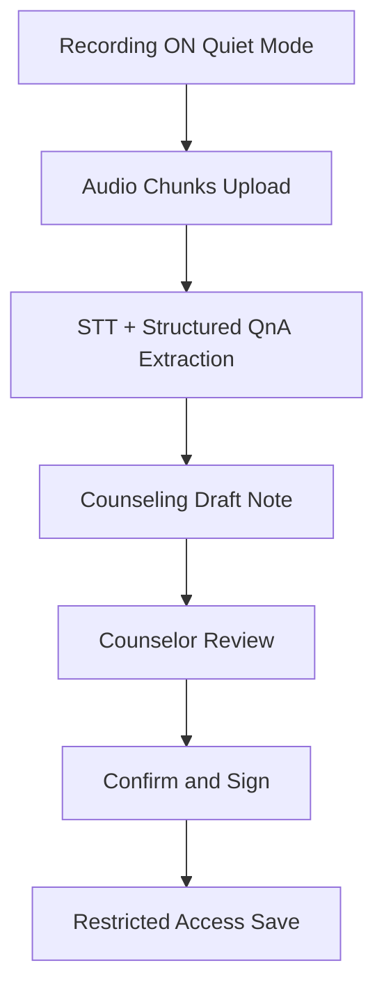
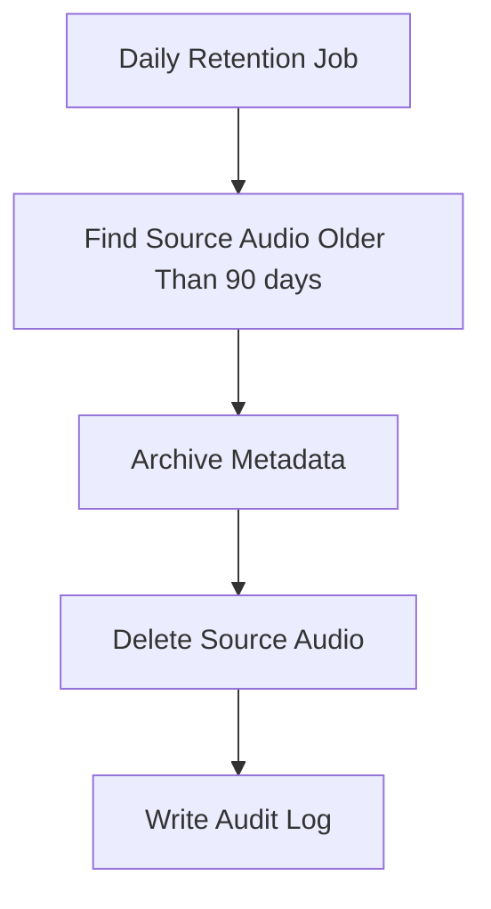

# BATA Secretary - Screen Flow and API Design

## 1. Product Modes

### Mode A: Meeting Mode
- Multi-speaker sessions
- Mid-session topic cards
- Finalized meeting minutes with action items

### Mode B: Counseling Mode
- Quiet, low-visibility flow
- QnA-based structured notes
- Counselor confirmation required before finalization

## 2. High-Level Architecture
- Mobile app: session control, audio chunk upload, image upload
- API server: auth, session orchestration, ingestion endpoints
- Processing workers: STT, speaker diarization, OCR, summarization
- Record store: source media, transcript, drafts, final signed documents
- Audit store: access logs, edit logs, signature logs

## 3. Screen Flow

### 3.1 Login and Session Start

### 3.2 Meeting Mode Flow

### 3.3 Counseling Mode Flow

### 3.4 Retention and Purge Flow

## 4. API List (MVP)

## 4.1 Authentication
- POST /api/v1/auth/login
  - Request: username, password
  - Response: access_token, refresh_token, role
- POST /api/v1/auth/refresh
- POST /api/v1/auth/logout

## 4.2 Session Management
- POST /api/v1/sessions
  - Create session
  - Fields: mode(meeting|counseling), title, participants(optional)
- POST /api/v1/sessions/{session_id}/start
- POST /api/v1/sessions/{session_id}/stop
- GET /api/v1/sessions/{session_id}
- GET /api/v1/sessions?status=active|completed

## 4.3 Ingestion APIs
- POST /api/v1/sessions/{session_id}/audio/chunks
  - Multipart chunk upload
  - Fields: chunk_index, started_at, duration_ms, codec(opus)
- POST /api/v1/sessions/{session_id}/images
  - Photo upload for whiteboard or notes
- POST /api/v1/sessions/{session_id}/notes
  - Manual text notes from user

## 4.4 Live Summary and Topic Cards
- GET /api/v1/sessions/{session_id}/live-summary
  - Returns current topics, subtopics, risks, actions
- POST /api/v1/sessions/{session_id}/cards/{card_id}/confirm
- PATCH /api/v1/sessions/{session_id}/cards/{card_id}

## 4.5 Draft and Finalization
- POST /api/v1/sessions/{session_id}/drafts/generate
- GET /api/v1/sessions/{session_id}/drafts/latest
- PATCH /api/v1/sessions/{session_id}/drafts/latest
- POST /api/v1/sessions/{session_id}/confirm
  - Marks content as reviewed
- POST /api/v1/sessions/{session_id}/signatures
  - Fields: signer_id, signer_role, signature_payload, signed_at
- GET /api/v1/sessions/{session_id}/final

## 4.6 Export and Share
- POST /api/v1/sessions/{session_id}/export
  - format: pdf|docx|json
- POST /api/v1/sessions/{session_id}/email
  - Restricted by policy and role

## 4.7 Access and Audit
- GET /api/v1/audit/sessions/{session_id}
- GET /api/v1/audit/users/{user_id}
- GET /api/v1/admin/retention/status
- POST /api/v1/admin/retention/run

## 5. API Rules
- All endpoints require auth except login/refresh
- Role-based controls: counselor, manager, admin, auditor
- Source media analysis must run on internal server only
- Source audio retention: 90 days
- Every confirm/sign/export action must create audit records

## 6. Initial Non-Functional Targets
- Active session concurrency: 1 (expand to 2 after profiling)
- Average chunk ingest latency: under 2 sec in LAN
- Draft generation after stop: under 120 sec for 1-hour session
- Availability target for MVP: 99.0%
